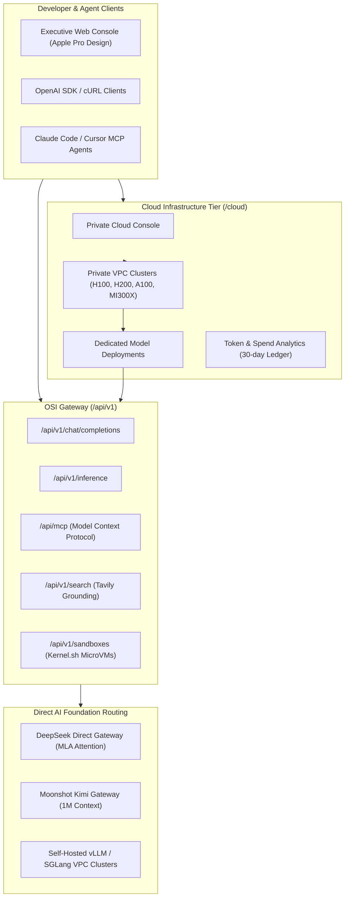

# OpenSuperIntelligence (OSI)

> **Sovereign Enterprise Open-Source AI Infrastructure & Cloud Inference Provider**  
> An **Arcane Echos Technologies SAS** Product.

[](https://nextjs.org/)
[](https://www.typescriptlang.org/)
[](https://tailwindcss.com/)
[](LICENSE)

---

## Overview


**OpenSuperIntelligence (OSI)** is an enterprise-grade AI cloud inference provider and sovereign infrastructure console. It enables enterprises to orchestrate open-weight frontier foundation models (**DeepSeek V4 Pro**, **Moonshot Kimi K3**, **Qwen 2.5 Coder**, **Llama 4 Maverick**, **Wan 2.1 Video Diffusion**) across private VPC GPU clusters with:

- **70% to 85% Cost Reduction** compared to proprietary closed APIs (GPT-4o, Claude 3.5 Sonnet).
- **Private VPC GPU Fleet Management**: Dedicated clusters across `us-east-1`, `eu-west-1`, `ap-southeast-1` on NVIDIA H100 SXM, H200 SXM, A100 80GB, L40S, and AMD MI300X.
- **Model Deployment Engine**: Automated autoscaling triggers (latency, utilization, queue depth), P50/P99 observability, and OpenAI-compatible drop-in endpoints.
- **Real-Time Metering & Financial Telemetry**: Granular token burn rate and request-level ledger with +20% operating margin tracking.
- **Model Context Protocol (MCP)**: Native HTTP transport endpoint (`/api/mcp`) for seamless integration with Claude Code, Cursor, and Windsurf.
- **Apple Pro Aesthetic**: Sleek Cupertino-grade interface featuring SF Pro typography, fine hairlines, and authentic light/dark themes.

---

## Architecture



---

## Getting Started

### 1. Prerequisites
- Node.js 20+
- pnpm 9+

### 2. Installation
```bash
# Clone the repository
git clone https://github.com/rcdev714/opensuperintelligence.git
cd opensuperintelligence

# Install dependencies
pnpm install

# Setup environment variables
cp .env.example .env.local
```

### 3. Run Development Server
```bash
pnpm dev
```
Open [http://localhost:3000](http://localhost:3000) in your browser.

### 4. Production Build
```bash
pnpm build
pnpm start
```

---

## Cloud Inference & API Usage

### Drop-in OpenAI SDK Compatibility
```typescript
import OpenAI from "openai";

const client = new OpenAI({
  baseURL: "https://your-domain.com/api/v1",
  apiKey: process.env.OSI_API_KEY || "osi_live_default",
});

const completion = await client.chat.completions.create({
  model: "deepseek-v4-pro",
  messages: [{ role: "user", content: "Analyze sparse MoE attention compression." }],
});

console.log(completion.choices[0].message.content);
```

### Connect Claude Code or Cursor via MCP
Add to your `.cursor/mcp.json` or run:
```bash
claude mcp add osi --transport http https://your-domain.com/api/mcp
```

---

## Deploy on Vercel

The platform is pre-configured for zero-config Vercel deployment with `vercel.json`:
- Framework: Next.js (App Router)
- Build command: `pnpm build`
- 60s max execution duration for streaming inference routes (`/api/**/*`)
- Comprehensive enterprise security and CORS headers

[](https://vercel.com/new/clone?repository-url=https://github.com/rcdev714/opensuperintelligence)

---

## Owner & License

© 2026 **OpenSuperIntelligence**. An **Arcane Echos Technologies SAS** product. All rights reserved.
